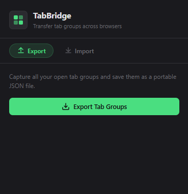
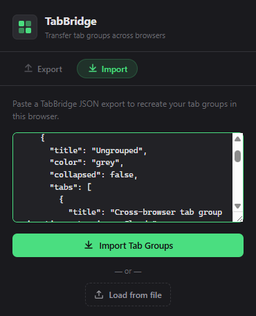

<p align="center">
  
</p>

<h1 align="center">TabBridge</h1>

<p align="center">
  <strong>Transfer your tab groups between Chrome, Brave, and Edge — in seconds.</strong>
</p>

<p align="center">
  <a href="#"></a>
  <a href="#"></a>
  <a href="#"></a>
  <a href="#"></a>
  <a href="LICENSE"></a>
  <a href="#"></a>
</p>

<p align="center">
  <a href="https://github.com/sumitahmed/TabBridge/releases/latest/download/tabbridge.zip">
    
  </a>
</p>

---

## The Problem

You've got 40 tabs organized into perfect groups. Now you need them in another browser.

Chrome doesn't let you transfer tab groups. Neither does Brave. Or Edge. You're stuck copying URLs one by one.

## The Solution

**TabBridge** exports all your tab groups — names, colors, tabs — into a single JSON file. Open any Chromium browser, import the file, and your groups are back. Exactly how you left them.

No accounts. No cloud. No backend. Just a JSON file.

---

## Features

- **Export** — Captures all tab groups with titles, colors, and URLs
- **Import** — Recreates tab groups with correct names and colors
- **Download** — Save as a `.json` file
- **Copy** — Copy JSON to clipboard
- **File upload** — Import from a saved JSON file
- **Cross-browser** — Works on Chrome, Brave, Edge, and any Chromium browser
- **Offline** — Everything runs locally, nothing leaves your machine
- **Lightweight** — No frameworks, no build step, under 30KB total

---

## Screenshots

<p align="center">
  
  &nbsp;&nbsp;&nbsp;
  
</p>

<p align="center">
  <sub>Export view · Import view</sub>
</p>

---

## Installation

### Manual Install (Recommended)

1. [**Download the latest ZIP**](https://github.com/sumitahmed/TabBridge/releases/latest/download/tabbridge.zip) or clone this repo
2. Unzip the folder
3. Open your browser and go to:
   - Chrome → `chrome://extensions`
   - Brave → `brave://extensions`
   - Edge → `edge://extensions`
4. Enable **Developer Mode** (top-right toggle)
5. Click **Load unpacked**
6. Select the unzipped `TabBridge` folder
7. Done. The icon appears in your toolbar.

### Chrome Web Store

> Coming soon.

---

## Usage

### Export

1. Organize your tabs into groups (right-click a tab → *Add tab to new group*)
2. Click the **TabBridge** icon in your toolbar
3. Hit **Export Tab Groups**
4. Preview your data, then **Download JSON** or **Copy JSON**

### Import

1. Open a different browser (or the same one)
2. Install TabBridge
3. Click the icon → switch to the **Import** tab
4. Paste your JSON or click **Load from file**
5. Hit **Import Tab Groups**
6. Your groups are recreated with the correct names and colors

---

## JSON Format

TabBridge uses a simple, human-readable JSON format:

```json
{
  "version": "1.0",
  "exportedAt": "2025-05-07T10:15:00.000Z",
  "browser": "Chrome",
  "groups": [
    {
      "title": "Research",
      "color": "blue",
      "collapsed": false,
      "tabs": [
        {
          "title": "OpenAI",
          "url": "https://openai.com"
        },
        {
          "title": "Anthropic",
          "url": "https://anthropic.com"
        }
      ]
    }
  ]
}
```

You can edit this file by hand if you want. It's just JSON.

---

## Tech Stack

| Component | Technology |
|---|---|
| UI | HTML + CSS |
| Logic | Vanilla JavaScript |
| Platform | Chrome Extension Manifest V3 |
| APIs | `chrome.tabs`, `chrome.tabGroups`, `chrome.downloads` |
| Backend | None |
| Database | None |
| Dependencies | None |

---

## Limitations

- `chrome://`, `brave://`, and `edge://` internal pages cannot be recreated (browser restriction)
- Tab group colors are limited to the 9 built-in options: grey, blue, red, yellow, green, pink, purple, cyan, orange
- Pinned tab state is not preserved (yet)

---

## Project Structure

```
TabBridge/
├── manifest.json      # Extension config (Manifest V3)
├── popup.html         # Popup UI
├── popup.js           # Export/import logic
├── styles.css         # Dark theme
├── background.js      # Service worker
├── icons/
│   ├── icon16.png
│   ├── icon48.png
│   └── icon128.png
├── LICENSE            # MIT
└── README.md
```

---

## Contributing

Contributions are welcome. If you find a bug or want a feature:

1. Fork this repo
2. Create a branch (`git checkout -b feature/my-feature`)
3. Commit your changes
4. Push and open a Pull Request

Please keep it simple — no frameworks, no build tools, no TypeScript. The goal is a zero-dependency extension anyone can read and modify.

---

## Roadmap

- [ ] Pinned tab support
- [ ] Window-level export (not just current window)
- [ ] Selective group export (pick which groups to export)
- [ ] Chrome Web Store listing
- [ ] Tab favicons in the preview

---

## License

[MIT](LICENSE) — do whatever you want with it.

---

<p align="center">
  <sub>Built by <a href="https://github.com/sumitahmed">Sk Sumit Ahmed</a></sub>
</p>
